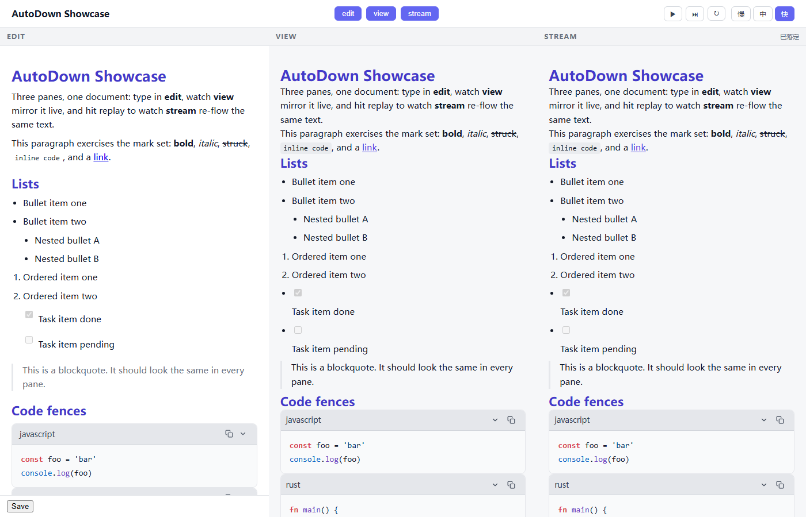

# AutoDown Showcase (PLAN-059)

给人看、给人玩的三模式全景 demo：**edit / view / stream 三栏任意组合**，
共享同一文档单源。同一套 Auto 源（`auto/src/front/*.at`）驱动双轨——
vue 网页轨 + iced VM 桌面轨（plan 040 契约流先例）。



## 三 demo 分立（架构裁定）

| 应用 | 身份 | 门禁 |
|---|---|---|
| `demo/` | VM 平价锚 + 工程 playground（e2e/vm-smoke/证据 PNG 挂默认布局） | demo e2e + vm-smoke |
| `stream-demo/` | 测试仪器（单一变量隔离：同一 StreamingRenderer 两态对拍） | 051 view≡stream playwright 门 |
| `showcase/`（本包） | **展示面**——三模式全景 | 本包冒烟 e2e + build 门 |

PLAN-051 显式出域项（"demo 三模式开关……后续立项"）即本包；demo 与
stream-demo 全程零改动（验收含 `git diff master -- autodown/demo
autodown/stream-demo` 为空）。

## 跑法

```sh
# vue 网页轨（端口 5175）
pnpm dev

# VM 桌面轨（AutoUI MCP 可选挂 9359 供脚本驱动）
cd auto && AUTOUI_MCP_PORT=9359 D:/autostack/auto-lang/target/debug/auto.exe run -r vm

# 冒烟 e2e（7 用例）
E2E_PORT=5299 pnpm test

# 契约流 regen（改 .at 后）
cd auto && bash gen/regen.sh

# VM 种子适配再生成（改 sample.ts 后）
cd auto && node scripts/gen-vm-content.mjs
```

## 数据流

```
sample.ts ──Init──▶ .content（文档单源）
                     ├─ edit 栏: autodown_editor  oninput:.Edit 回写
                     ├─ view 栏: autodown streaming:false（实时直映）
                     └─ stream 栏: autodown streaming:true ◀─ .feed_text
feed_text 双源分派（demo csb_* 先例）：
  vue 轨  → showcaseBridge（ext 桥 setInterval 90ms 切片，T6）
  VM 轨   → widget state（FeedStep 状态机，T5；▶ 缺 timer 原语，步进代用）
FeedReset/FeedPlayPause 起播时快照 .content → feed_source（播放期编辑不打扰重播）
```

- feed 状态机：`FeedReset`（快照+清窗）/`FeedStep`（前缀切片
  `substr(0, min(len, len+speed))`）/`FeedPlayPause`/`FeedSetSpeed`
  （24|96|384 字符/步）。
- 落定语义：`settled` = feed_text == feed_source 且非空；栏头状态行
  四态（未开始/流式中 n%/已暂停/已落定）。
- 主题：`dark_mode`/`accent_color` 经引擎声明 props 三栏贯通 +
  `.app-dark` chrome（051 语义）；⚙ 弹层 = settings_popover.at（051
  demo 原样复制）。

## e2e 锚选择器（本包自有，不碰 demo 的 .left/.right）

| 锚 | 元素 |
|---|---|
| `.col-edit` / `.col-view` / `.col-stream` | 三栏容器 |
| `.toggle-edit` / `.toggle-view` / `.toggle-stream` | 栏目开关（开态含 `.toggle-on`） |
| `.btn-play`（vue 轨 only）/ `.btn-step` / `.btn-replay` | feed 控制 |
| `.speed-lo` / `.speed-mid` / `.speed-hi` | 速度三档（激活含 `.speed-btn-on`） |
| `.pane-status` | stream 栏头状态行 |
| `.settings-trigger` | ⚙ 钮 |

## 已知豁免 / 环境注意

- **VM 轨无自动播放**：.at 无 timer 原语，▶ 仅 vue 轨（`if is_vue() !=
  None` 门控，VM 臂不渲染）；VM 用 ⏭ 步进。DEBTS 059 行在册，正修属
  auto-lang tick 原语（彼仓）。
- **VM 子件注册**：兄弟 .at widget（settings_popover）必须顶层
  `use settings_popover` 登记——auto-lang `register_transitive_widgets`
  只沿 use 语句链收集（demo app.at L73/L78 隐含先例）；缺行则子件在
  VM 永不渲染（vue 轨不受影响）。
- **VM 轨截图**：锁屏/最小化时窗口 zero-size（049 环境族），MCP
  `autoui_screenshot` 拒拍；功能验证走 `autoui_snapshot`/`autoui_state`
  合成通道（043 先例）。
- math/mermaid 未入种子（首屏算力 + VM 观感债）；编辑手动加入仍可渲染。
